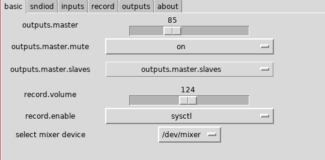
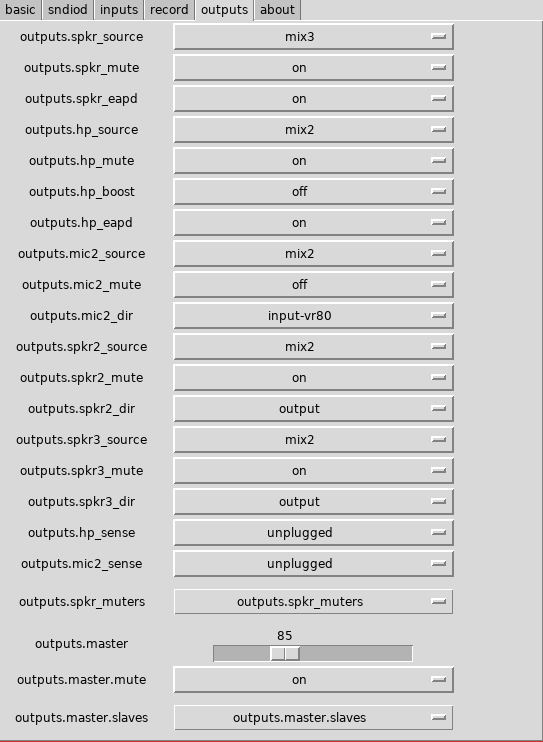

# gmixerctl

gmixerctl is a GUI wrapper for the OpenBSD
[`mixerctl`](https://man.openbsd.org/mixerctl) command. gmixerctl aims to have
100% feature parity with mixerctl, and may add a few more convenience features
in the future (such as setting sndiod flags).

gmixerctl is written in in Python3 with tkinter, and operates by wrapping
the mixerctl command itself.

## Screenshots




## Installation

```
python3 setup.py install
```

## Contributing

Contributions are more than welcome. If there is a feature you would like added
to gmixerctl, please feel free to open a pull request. In particular, I would
appreciate help implementing the following features:

* Changing the mixer device at run time (this may be a Tk limitation, but I'm
  not experienced enough with Tk at the moment)

* ~~Configuring `sndiod` flags (i.e. a menu for running `rcctl set sndiod flags
  -f rsnd/X ; rcctl restart sndiod`)~~

	* Support added in 0.1.0

* An elegant solution for rendering enum type controls with only the choices
  on and off as checkboxes, rather than dropdowns.

## Known Issues

* Configuring sndiod requires giving the user running gmixerctl access to run
  `/usr/sbin/rcctl` as root. This is overly broad, but I am unsure of the
  correct way to handle this, since limiting arguments with `doas.conf`
  requires knowing the exact set of arguments in advance.

* The information displayed in the "sndiod" tab does not update once the
  application has started.


## Rationale

My first attempt at writing gmixerctl was in the form of an imgui based C++
application which worked by calling into the same API as `mixerctl.c`, which is
to say just sending `ioctl()` calls straight to `/dev/mixer`. This attempt was
abandoned due to a number of issues, namely synchronous/immediate mode
rendering proved difficult to combine with polling the mixer state - setting
the framerate too high could crash the application, presumably by exceeding the
maximum throughput of the mixer device.

Python was selected as the implementation language, as I was already familiar
with it. Tkinter was chosen as the UI library due to it's reputation for
ease-of use, which I found it to live up to.

In principle, I could have written a Python wrapper for the relevant audio
control related `ioctl()` calls, but chose not to as the output of `mixerctl`
is easy to parse, and has proved not to be a bottleneck. If someone else would
like to write such a wrapper, I would be happy to use it however.
